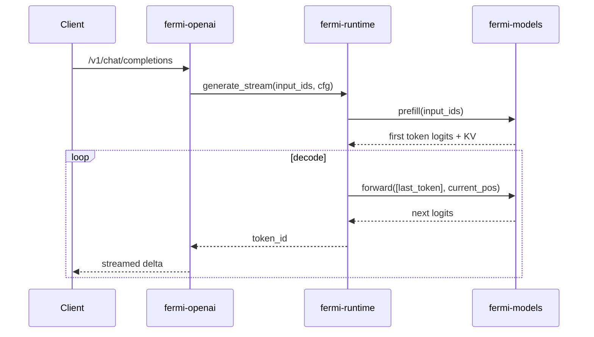

# Fermi-Infer：一个 Rust 原生模型推理工具的架构设计与开发流程

> 这是一篇项目分享文，重点回答三个问题：做这个项目的目的是什么、整体架构如何设计、开发流程如何落地和扩展。

## 1. 项目背景与目标

Fermi-Infer 的定位是一个面向小语言模型（SLM）的本地推理栈，核心目标是：

1. 在本地设备上提供低延迟、可流式的推理能力。
2. 优先优化 Apple Silicon（Metal/F16），同时兼容 CUDA/CPU。
3. 提供统一入口（CLI、OpenAI 兼容 HTTP、gRPC）。
4. 建立可扩展的多架构模型接入路径（当前重点 Qwen2.5/3 与 Phi-3 风格）。

项目关注点不是“跑通单模型”，而是“形成可持续演进的推理工程”。

---

## 2. 整体架构

Fermi-Infer 基于 Rust workspace，按职责分层：

- `fermi-io`：模型文件发现/下载、架构识别、配置兼容修复。
- `fermi-models`：模型结构实现（attention、KV cache、前向）。
- `fermi-runtime`：统一推理生命周期（prefill/decode/采样）。
- `fermi-openai`：OpenAI 兼容 HTTP API 与 SSE 流式输出。
- `fermi-grpc`：gRPC 服务与会话管理。
- `fermi-cli`：本地交互入口，便于验证与调试。

```mermaid
flowchart LR
    U[Client / SDK / Browser] --> A[fermi-openai | fermi-grpc | fermi-cli]
    A --> B[fermi-runtime]
    B --> C[fermi-io]
    B --> D[fermi-models]
    C --> E[HF Cache / Local Dir / Remote Repo]
    D --> F[Candle Backend: Metal / CUDA / CPU]
```

### 2.1 关键架构原则

1. 入口层与推理层解耦：接口持续迭代不影响模型内核。
2. 模型架构可插拔：按 `config.json` 自动识别并创建引擎。
3. 统一生命周期：所有入口复用同一生成流程，行为一致。
4. 配置多层覆盖：请求参数 > 环境变量 > `fermi.toml` > 默认值。

---

## 3. 端到端运行流程

### 3.1 启动流程（OpenAI 服务）

1. 读取配置（文件 + 环境变量）。
2. 初始化设备（Metal/CUDA/CPU）。
3. 通过 `ModelBuilder` 完成：
   - 模型文件定位或下载；
   - 架构识别（Qwen/Phi）；
   - 配置解析与字段兼容补齐；
   - safetensors mmap 加载并构建引擎。
4. 初始化 tokenizer、stop tokens、engine pool、并发控制。
5. 启动 HTTP 服务并暴露 `/v1/chat/completions` 等端点。

### 3.2 请求流程（生成一次回复）

1. API 层规范化消息并组装 prompt。
2. runtime 选择引擎实例，清理当前轮次 cache。
3. prefill 处理完整输入，拿到首 token。
4. decode 循环逐 token 生成并采样。
5. 命中 stop token 或上限后结束，流式回传结果。



---

## 4. 关键工程设计

### 4.1 接入层：兼容优先

在 `fermi-io` 里，我把模型接入做成“多来源 + 自动识别 + 配置补齐”：

1. 本地目录、HF cache、在线下载按顺序尝试。
2. 通过 `model_type`/`architectures` 自动识别架构。
3. 对常见缺省字段做兼容修复，优先保证可加载性。

这直接降低了不同 checkpoint 的接入摩擦。

### 4.2 推理层：统一生命周期

在 `fermi-runtime` 里通过 `InferenceEngine` 抽象推理行为：

1. `prefill`：处理上下文并输出首 token。
2. `decode`：增量前向，复用 KV cache。
3. `sampling`：统一温度、top-p、重复惩罚策略。

这样无论上层是 CLI、HTTP 还是 gRPC，都复用同一引擎逻辑。

### 4.3 模型层：围绕关键路径优化

在 `fermi-models` 的 Qwen 路线里，重点放在：

1. GQA：降低 KV cache 内存占用。
2. RoPE offset：适配增量解码。
3. 分段 KV cache：降低长序列拼接成本。
4. decode 快路径：优化 Metal 场景单 token 生成。

---

## 5. 开发流程：从功能闭环到工程闭环

### 5.1 日常迭代流程

1. 先在 CLI 跑通最小功能闭环。
2. 再打通 OpenAI/gRPC 接口行为一致性。
3. 引入配置、错误处理、并发控制等工程要素。
4. 最后做性能与可观测性优化。

我在这个项目里长期遵循一个顺序：  
**正确性 > 可维护性 > 性能。**

### 5.2 新增模型架构的推荐流程

1. 在 `fermi-models` 新增模型模块（Config + 前向 + KV cache）。
2. 在 `fermi-io` 新增架构识别与配置解析。
3. 在 `fermi-runtime` 新增对应 Engine 并接入 `ModelBuilder`。
4. 在 `fermi-openai`/`fermi-grpc`/`fermi-cli` 做端到端验证。

这使“新增架构”变成标准流程，而不是一次性改造。

---

## 6. 项目实践中的经验总结

1. 分层架构是后续扩展能力的前提，不是“代码风格问题”。
2. 配置兼容是高价值投入，直接决定模型接入成功率。
3. Prefill/Decode 边界清晰，才能稳定优化首 token 延迟。
4. 没有可观测性就没有有效优化，日志和指标必须前置。

---

## 7. 下一步计划

接下来会继续推进：

1. 更高吞吐的调度/批处理策略。
2. KV cache 与 attention 的进一步优化。
3. 更完整的延迟与吞吐指标体系。
4. 更多模型后端与量化能力。

---

## 8. 结语

Fermi-Infer 当前已经形成完整可用链路：  
从模型接入、推理执行到 API 服务都可稳定落地。

如果你也在做本地推理或轻量服务化，欢迎基于这套思路继续扩展：  
**模块解耦、生命周期统一、兼容优先、持续优化。**
