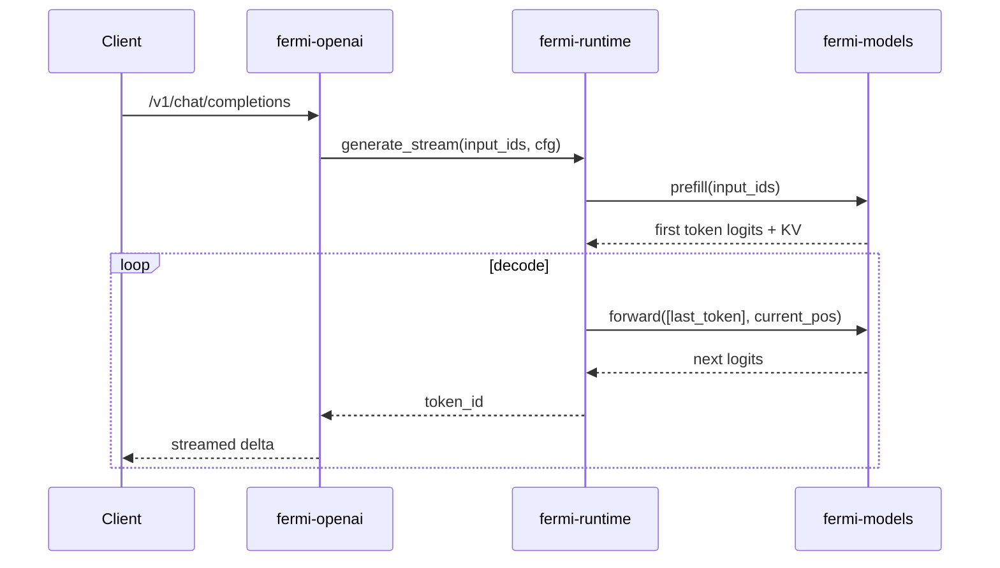

# Fermi-Infer 项目总览：整体架构、开发流程与目标

## 1. 项目目的

Fermi-Infer 是一个面向小语言模型（SLM）的 Rust 原生推理栈，目标是：

1. 在消费级设备上提供低延迟、可流式的本地推理能力。
2. 优先优化 Apple Silicon（Metal/F16），同时支持 CUDA/CPU。
3. 提供统一入口（CLI、OpenAI HTTP、gRPC），降低集成成本。
4. 用工程化方式支持多模型架构（当前重点：Qwen2.5/3、Phi-3 风格）。

一句话定位：**Rust-first、Mac-friendly、服务化可落地的轻量推理引擎**。

---

## 2. 整体架构

项目使用 Rust workspace 组织，核心 crate 职责如下：

- `crates/fermi-io`：模型文件获取、架构识别、配置解析与兼容修复。
- `crates/fermi-models`：模型结构实现（如 Qwen/Phi 的前向与 KV cache 逻辑）。
- `crates/fermi-runtime`：推理生命周期（prefill/decode、采样、模型装载）。
- `crates/fermi-openai`：OpenAI 兼容 HTTP API（含流式 SSE）。
- `crates/fermi-grpc`：gRPC 服务层与会话管理。
- `crates/fermi-cli`：本地交互式命令行入口。
- `crates/fermi-core`、`crates/fermi-metrics`：预留扩展模块（当前为占位）。

### 2.1 分层视图

```mermaid
flowchart LR
    U[Client / SDK / Browser] --> A[fermi-openai | fermi-grpc | fermi-cli]
    A --> B[fermi-runtime]
    B --> C[fermi-io]
    B --> D[fermi-models]
    C --> E[HF Cache / Local Dir / Remote Repo]
    D --> F[Candle Backend: Metal / CUDA / CPU]
```

### 2.2 关键设计点

1. **入口与推理解耦**：OpenAI/gRPC/CLI 都通过 `InferenceEngine` 统一调用。
2. **模型可插拔**：按 `config.json` 自动识别架构并创建对应引擎。
3. **推理生命周期稳定**：统一 `prefill -> decode -> sampling -> stop`。
4. **配置多层覆盖**：请求参数 > 环境变量 > `fermi.toml` > 默认值。

---

## 3. 端到端运行流程

### 3.1 启动阶段（以 OpenAI 服务为例）

1. 读取配置（`fermi.toml` + 环境变量覆盖）。
2. 选择设备（Metal/CUDA/CPU）。
3. 调用 `ModelBuilder`：
   - 下载/定位模型文件；
   - 自动识别架构；
   - 解析 config 并补齐兼容字段；
   - mmap 加载 safetensors，构建推理引擎。
4. 初始化 tokenizer、stop tokens、engine pool、并发信号量。
5. 启动 HTTP 服务并暴露 `/v1/chat/completions` 等端点。

### 3.2 请求阶段

1. API 层组装 prompt（含 system/developer/user 消息规范化）。
2. 获取一个 engine 实例并清理本轮 KV cache。
3. 走 `generate_stream`：
   - prefill 产出首 token；
   - decode 循环增量生成；
   - 采样策略控制输出分布；
   - 命中 stop 或达上限结束。
4. 将 token 解码后以 SSE 或 JSON 返回。



---

## 4. 开发流程（团队协作视角）

### 4.1 日常开发闭环

1. 新建分支：围绕单一目标改动（如“优化采样”或“新增模型”）。
2. 本地开发：优先在 `fermi-runtime`/`fermi-models` 做最小可验证改动。
3. 快速验证：
   - `cargo check`
   - `cargo run -p fermi-infer --features metal`（CLI）
   - `cargo run -p fermi-openai --features metal`（HTTP）
4. 回归检查：确保 OpenAI 接口与 CLI 行为一致。
5. 提交 PR：附上关键日志、性能变化和兼容性说明。

### 4.2 新增一个模型架构的推荐流程

1. 在 `fermi-models` 新增模块（例如 `foo.rs`）：
   - `Config` 定义；
   - `Model` 前向实现；
   - KV cache 管理。
2. 在 `fermi-io` 增加识别与 config 解析：
   - `detect_model_arch` 增加判断；
   - `load_foo_config` 及必要字段兼容补齐。
3. 在 `fermi-runtime` 扩展：
   - 新增 `FooEngine`，实现 `InferenceEngine`；
   - `ModelBuilder` 里接入 `Foo` 分支。
4. 在服务层验证（OpenAI/gRPC/CLI）：
   - 加载同一模型 ID 能正常启动；
   - 流式输出、stop、采样行为符合预期。

---

## 5. 当前开发重点与工程目标

短期重点（代码已体现）：

1. Qwen/Phi 推理链路稳定化。
2. KV cache 与 attention 路径优化。
3. OpenAI 兼容行为与错误语义统一。

中期目标（路线图方向）：

1. 更强的吞吐能力（批处理/调度策略）。
2. 更细粒度指标体系（latency、cache 命中、token/s）。
3. 更多模型后端与权重量化能力。

---

## 6. 建议新成员阅读顺序

1. `README.zh-CN.md`：项目定位与启动方式。
2. `crates/fermi-io/src/lib.rs`：模型发现、识别、解析。
3. `crates/fermi-runtime/src/loader.rs` + `engine.rs`：推理生命周期主干。
4. `crates/fermi-models/src/qwen3.rs`：模型前向、attention、KV cache。
5. `crates/fermi-openai/src/main.rs`：服务化接入与流式输出。

---

## 7. 与 Qwen 深挖文档的关系

如果你想深入模型内部实现（attention/KV cache/prefill-decode），继续阅读：

- `docs/qwen-architecture-tech-blog.zh-CN.md`

这份文档负责“项目全局视角”，Qwen 深挖文档负责“模型内核视角”。
