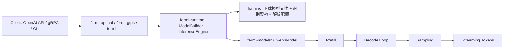
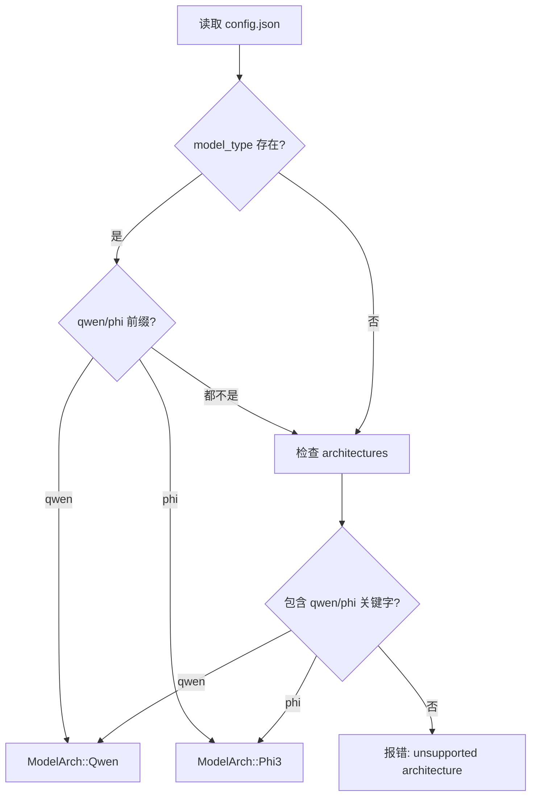
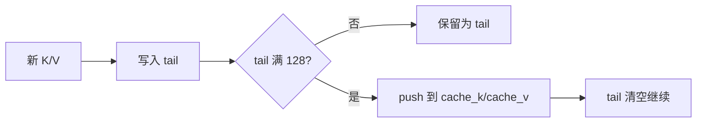
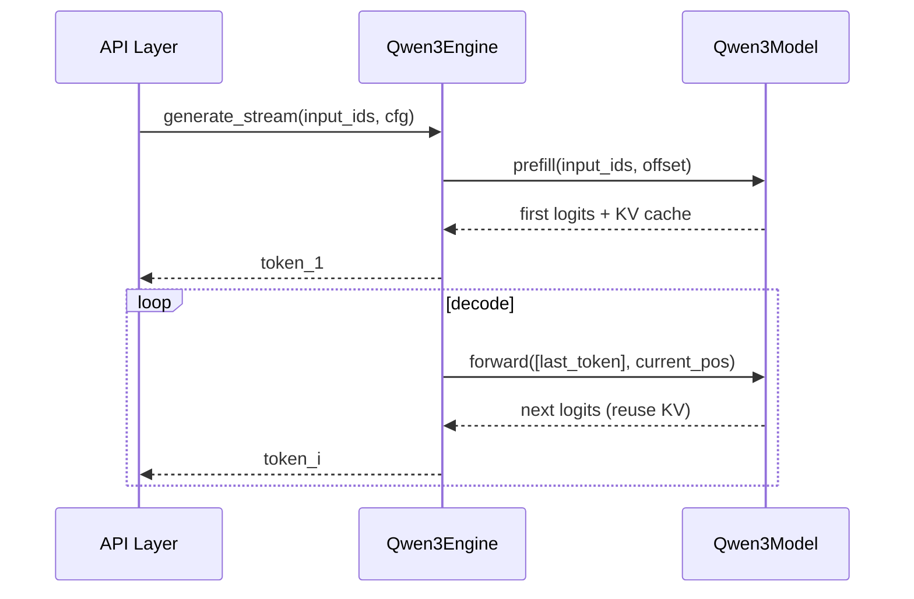
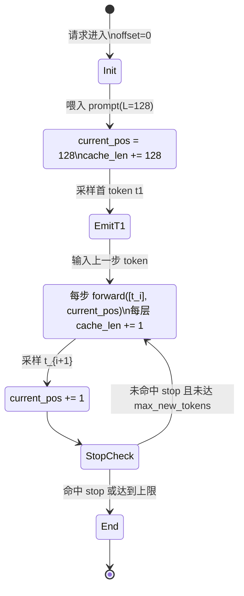

# Fermi-Infer 模型推理工具之 Qwen2.5/3 推理架构构建实战

> 目标读者：已经知道 Transformer 基础，但想看“Qwen 架构如何在工程里真正跑起来”。
> 本文完全基于仓库源码，不做论文式泛化描述。

## 1. 先给结论

Fermi Infer 的 Qwen 路线有三个关键设计：

1. 模型层实现上，走的是标准 decoder-only 路线，但把 GQA、RoPE、SwiGLU、RMSNorm 全部按推理友好方式落地。
2. 推理层实现上，采用 `prefill + decode` 两阶段，并将 KV cache 做成固定 chunk 的分段结构，避免频繁全量拼接。
3. 服务层实现上，统一抽象 `InferenceEngine`，上层 API 不关心底层是 Qwen 还是 Phi，便于扩展多架构。

---

## 2. 全链路总览（请求到 token）



你可以把这条链路理解为：

- `fermi-io` 负责“把模型准备好”；
- `fermi-models` 负责“把前向算出来”；
- `fermi-runtime` 负责“把推理生命周期跑起来”；
- `fermi-openai/grpc/cli` 负责“把 token 变成可消费接口”。

---

## 3. 模型装载与架构识别：不是只下载权重

### 3.1 文件发现顺序（容灾友好）

`download_model_files` 会按顺序查找模型文件：

1. `FERMI_MODEL_DIR`
2. 把 `model_id` 当本地目录
3. Hugging Face 本地缓存
4. 最后才走在线下载（若允许网络）

核心代码在 `crates/fermi-io/src/lib.rs:20-71`。

### 3.2 自动识别 Qwen/Phi 架构

通过 `config.json` 的 `model_type` 与 `architectures` 两层兜底判断架构，见 `crates/fermi-io/src/lib.rs:208-240`。



### 3.3 配置兼容修复（工程里非常关键）

`load_qwen_config` 会在解析前补齐常见缺省字段，见 `crates/fermi-io/src/lib.rs:242-282`：

- 缺 `num_key_value_heads` 时，退化成 `num_attention_heads`；
- 缺 `head_dim` 时，用 `hidden_size / num_attention_heads` 推导；
- `sliding_window = null` 时，用 `max_position_embeddings` 兜底。

这一步直接决定“不同来源 checkpoint 能否开箱即用”。

---

## 4. Qwen3Model 结构：代码级剖面

核心文件：`crates/fermi-models/src/qwen3.rs`。

### 4.1 总体结构图

```mermaid
flowchart TD
    A[input_ids] --> B[Embedding: model.embed_tokens]
    B --> C[Block 0]
    C --> D[Block 1]
    D --> E[...]
    E --> F[Block N-1]
    F --> G[RMSNorm: model.norm]
    G --> H[取最后一个位置 x[:, -1, :]]
    H --> I[lm_head]
    I --> J[logits]
```

对应代码：

- 构建层：`Qwen3Model::new`（`qwen3.rs:450-472`）
- 前向主干：`Qwen3Model::forward`（`qwen3.rs:474-485`）

### 4.2 一个 Block 里到底做了什么

`Block` 代码在 `qwen3.rs:399-441`，逻辑是标准 pre-norm：

1. `rms_1 -> attention -> residual add`
2. `rms_2 -> mlp -> residual add`

这一点和 Qwen 系列常见推理结构一致。

---

## 5. Attention 深挖：GQA、RoPE、双路径计算

### 5.1 参数形态和张量变形

`Attention::new`（`qwen3.rs:84-132`）定义了：

- `q_proj`: `hidden -> num_heads * head_dim`
- `k_proj/v_proj`: `hidden -> num_kv_heads * head_dim`
- `o_proj`: `num_heads * head_dim -> hidden`

注意 `q_proj/k_proj/v_proj/o_proj` 都是 `linear_no_bias`。

```rust
let q_proj = linear_no_bias(hidden_size, num_heads * head_dim, vb.pp("q_proj"))?;
let k_proj = linear_no_bias(hidden_size, num_kv_heads * head_dim, vb.pp("k_proj"))?;
let v_proj = linear_no_bias(hidden_size, num_kv_heads * head_dim, vb.pp("v_proj"))?;
let o_proj = linear_no_bias(num_heads * head_dim, hidden_size, vb.pp("o_proj"))?;
```

前向里的核心 reshape 在 `qwen3.rs:145-154`：

- Q 变为 `[B, num_heads, T, head_dim]`
- K/V 变为 `[B, num_kv_heads, T, head_dim]`

```rust
let q = q
    .reshape((b, seq_len, self.num_heads, self.head_dim))?
    .transpose(1, 2)?;
let k = k
    .reshape((b, seq_len, self.num_kv_heads, self.head_dim))?
    .transpose(1, 2)?;
let v = v
    .reshape((b, seq_len, self.num_kv_heads, self.head_dim))?
    .transpose(1, 2)?
    .contiguous()?;
```

### 5.2 GQA 如何落地

GQA 通过 `repeat_kv` 实现（`qwen3.rs:207-218`）：

- 若 `num_heads == num_kv_heads`，直接返回；
- 否则按 `n_rep = num_heads / num_kv_heads` 扩展 KV。

```rust
fn repeat_kv(&self, x: &Tensor) -> Result<Tensor> {
    let n_rep = self.num_heads / self.num_kv_heads;
    if n_rep == 1 {
        Ok(x.clone())
    } else {
        let (b, n_kv_head, seq_len, head_dim) = x.dims4()?;
        let x = x
            .unsqueeze(2)?
            .expand((b, n_kv_head, n_rep, seq_len, head_dim))?;
        x.reshape((b, n_kv_head * n_rep, seq_len, head_dim))
    }
}
```

这能显著降低 KV cache 占用，尤其是长上下文场景。

### 5.3 RoPE 如何按 offset 应用

`RotaryEmbedding::forward`（`qwen3.rs:53-60`）做了两件事：

1. 用 `seqlen_offset` 从预计算的 `sin/cos` 中 `narrow` 当前窗口；
2. 分别对 Q/K 应用 rope。

```rust
let (_b, _h, seq_len, _d) = q.dims4()?;
let sin = self.sin.narrow(0, seqlen_offset, seq_len)?;
let cos = self.cos.narrow(0, seqlen_offset, seq_len)?;
let q_embed = candle_nn::rotary_emb::rope(&q.contiguous()?, &cos, &sin)?;
let k_embed = candle_nn::rotary_emb::rope(&k.contiguous()?, &cos, &sin)?;
```

这意味着 decode 阶段每步只处理新增位置，不需要重算历史位置旋转。

### 5.4 两条 attention 计算路径

`Attention::forward` 在 `qwen3.rs:170-201` 分两条路：

1. `seq_len == 1`（decode）：
   - 优先走分段注意力；
   - 若 `Metal + 仅 1 段`，走 `sdpa` 快路径（`qwen3.rs:179-184`）。
2. `seq_len > 1`（prefill）：
   - 先拼接 cache；
   - 构造 causal mask（`qwen3.rs:220-237`）；
   - `softmax` 后乘 V。

```rust
let y = if seq_len == 1 {
    if x.device().is_metal() && segments.len() == 1 {
        let (k_seg, v_seg) = segments[0];
        let k_rep = self.repeat_kv(k_seg)?;
        let v_rep = self.repeat_kv(v_seg)?;
        candle_nn::ops::sdpa(&q, &k_rep, &v_rep, 1. / (self.head_dim as f32).sqrt(), 1.)?
    } else {
        self.segmented_attention(&q, &segments)?
    }
} else {
    let (k_cat, v_cat) = self.concat_cache()?;
    let k_rep = self.repeat_kv(&k_cat)?;
    let v_rep = self.repeat_kv(&v_cat)?;
    let att = (q.matmul(&k_rep.t()?)? / (self.head_dim as f64).sqrt())?;
    let mask = self.causal_mask(seq_len, prev_cache_len, att.dtype(), x.device())?;
    let att = candle_nn::ops::softmax(&att.broadcast_add(&mask)?, 3)?;
    att.matmul(&v_rep.contiguous()?)?
};
```

### 5.5 分段 attention 核心实现（补全闭环）

`segmented_attention` 的关键代码如下（来自 `qwen3.rs:317-365`）：

```rust
let mut scores: Vec<Tensor> = Vec::with_capacity(segments.len());
let mut max_per_segment: Option<Tensor> = None;
for (k_seg, _) in segments {
    let k_rep = self.repeat_kv(k_seg)?;
    let seg_scores = (q.matmul(&k_rep.t()?)? / (self.head_dim as f64).sqrt())?;
    let seg_max = seg_scores.max_keepdim(3)?;
    max_per_segment = Some(match max_per_segment {
        Some(m) => m.maximum(&seg_max)?,
        None => seg_max,
    });
    scores.push(seg_scores);
}

let max_per_segment = match max_per_segment {
    Some(m) => m,
    None => candle_core::bail!("no kv segments for attention"),
};

let mut exp_scores: Vec<Tensor> = Vec::with_capacity(scores.len());
let mut denom: Option<Tensor> = None;
for seg_scores in scores {
    let exp = seg_scores.broadcast_sub(&max_per_segment)?.exp()?;
    let seg_sum = exp.sum_keepdim(3)?;
    denom = Some(match denom {
        Some(d) => d.broadcast_add(&seg_sum)?,
        None => seg_sum,
    });
    exp_scores.push(exp);
}

let denom = match denom {
    Some(d) => d,
    None => candle_core::bail!("failed to compute attention normalization"),
};

let mut output: Option<Tensor> = None;
for (exp, (_, v_seg)) in exp_scores.into_iter().zip(segments.iter()) {
    let v_rep = self.repeat_kv(v_seg)?;
    let weight = exp.broadcast_div(&denom)?;
    let seg_out = weight.matmul(&v_rep)?;
    output = Some(match output {
        Some(o) => o.broadcast_add(&seg_out)?,
        None => seg_out,
    });
}
```

我的理解：

1. 它不是“每段独立 softmax”，而是先找跨段全局 `max`，保证数值稳定。
2. 分母 `denom` 是跨段累加得到，因此概率归一化是全局一致的。
3. 这个写法在长上下文下避免了大张量一次性拼接，同时保持数学等价性。

### 5.6 张量维度推演（建议读者对照代码手推一次）

假设：

1. `B=1`
2. `hidden_size=2048`
3. `num_heads=16`
4. `num_kv_heads=8`
5. `head_dim=128`
6. `seq_len=T`

那么 attention 主路径里的核心维度是：

| 阶段 | 张量 | 维度 |
| --- | --- | --- |
| 输入 | `x` | `[1, T, 2048]` |
| 线性投影后 Q | `q_proj(x)` | `[1, T, 16*128] = [1, T, 2048]` |
| 线性投影后 K/V | `k_proj(x), v_proj(x)` | `[1, T, 8*128] = [1, T, 1024]` |
| reshape+transpose 后 Q | `q` | `[1, 16, T, 128]` |
| reshape+transpose 后 K/V | `k, v` | `[1, 8, T, 128]` |
| `repeat_kv` 后 K/V | `k_rep, v_rep` | `[1, 16, T, 128]` |
| score | `q @ k^T` | `[1, 16, T_q, T_k]` |
| 输出 | `att @ v_rep` | `[1, 16, T_q, 128]` |

这里最值得注意的是 `repeat_kv` 前后：

1. 存 cache 时只存 `num_kv_heads` 份 K/V，显著省内存。
2. 真正算 attention 时再扩展到 `num_heads`，把内存和算力开销拆开处理。

---

## 6. KV Cache 深挖：数据结构与写入策略

### 6.1 结构设计

`Attention` 里维护：

- 完整段：`cache_k/cache_v`
- 尾段：`cache_k_tail/cache_v_tail`
- 总长度：`cache_len`
- 固定段大小：`KV_CHUNK_SIZE = 128`（`qwen3.rs:82`）

### 6.2 追加策略

`append_kv`（`qwen3.rs:247-289`）逻辑：

1. 先计算 tail 还剩多少空间；
2. 把本次 `k/v` 切片填进去；
3. tail 满 128 后，转移到完整段向量；
4. 继续处理剩余切片。



### 6.3 与分段 attention 的关系

当 decode 进入多段 cache 时，会调用 `segmented_attention`。  
它的完整代码与数值稳定性推导已经放在 **5.5 小节**，这里不再重复展开。

---

## 7. Prefill/Decode 生命周期：从 runtime 视角

核心在 `crates/fermi-runtime/src/engine.rs` 的 `Qwen3Engine`。

### 7.1 Prefill

`prefill_with_offset`（`engine.rs:105-128`）：

1. 把整段 `input_ids` 一次前向；
2. 取最后 token 的 logits；
3. 采样出第一个新 token；
4. 设置 `current_pos = offset + input_len`。

### 7.2 Decode

`decode_step`（`engine.rs:130-143`）每次只喂 1 个 token：

1. 前向时传 `current_pos`；
2. 读第 0 位 logits；
3. 采样得到下一 token。

### 7.3 主循环

`generate_stream_internal`（`engine.rs:147-190`）：

1. 先 prefill，立即回调首 token；
2. 若命中 stop token，直接结束；
3. 否则循环 decode，直到达到 `max_new_tokens` 或用户回调中断。



### 7.4 Prefill vs Decode 的复杂度与内存直觉

把当前序列长度记为 `L`，新增 token 记为 `N`，head 维度记为 `d`。

Prefill（一次喂完整 prompt）：

1. 典型 attention 复杂度约 `O(L^2 * d)`。
2. 适合一次性把历史上下文全部编码进 KV cache。

Decode（每步 1 token）：

1. 第 `t` 步约 `O(t * d)`，`N` 步累计约 `O(N*L + N^2)`（忽略常数）。
2. 因为复用 KV cache，不会每步重算全部历史 token 的 K/V。

可理解为：

| 阶段 | 主要开销来源 | 是否重算历史 K/V |
| --- | --- | --- |
| Prefill | 全序列 attention | 否（首次构建） |
| Decode | 新 token 对历史 cache 的 attention | 否（直接复用） |

这也是为什么工程里要强依赖 `prefill + decode + KV cache` 三件套。

---

## 8. 采样策略与参数优先级

### 8.1 采样算法位置

- 运行时参数解析：`crates/fermi-runtime/src/sampling.rs`
- 实际 token 采样：`engine.rs:481+` 的 `sample_token`

### 8.2 关键机制

`sample_token` 做了这些事：

1. `temperature <= 0` 或 `top_p <= 0` 时退化为贪心；
2. `repeat_penalty` 只作用最近 64 token（`engine.rs:497-513`）；
3. 温度缩放；
4. 稳定 softmax；
5. `top_p` 采样，且大词表下限制 `TOP_P_MAX_K`，防止排序开销过高。

### 8.3 参数来源

`sampling_defaults_from_sources` + `resolve_sampling_params`（`sampling.rs:51-131`）实现：

`请求参数 > 环境变量 > 配置文件 > 内置默认值`

这对线上追溯“为什么这次采样行为变了”很关键。

---

## 9. API 层如何把推理能力对外暴露

以 OpenAI 兼容服务为例（`crates/fermi-openai/src/main.rs`）：

- 启动时创建 `engine_pool`（`main.rs:216-220` 附近）
- 每个请求通过 `Semaphore` 控制并发（`run_inference` 的 `acquire_owned`，`main.rs:538`）
- 使用 `next_engine` 轮询引擎实例（`main.rs:909-912`）
- `spawn_blocking` 执行 CPU/GPU 推理主循环，避免阻塞 async runtime（`main.rs:543`）
- streaming 场景逐 token 推送 SSE（`main.rs:577-671`）

这保证了接口层和模型层解耦，服务工程可独立演进。

### 9.1 一次真实请求的状态演进（trace）

下面给一个简化示例，帮助读者把 runtime 状态变量和代码对上：

1. 输入 prompt token 长度 `L=128`，`offset=0`。
2. `prefill_with_offset` 后：
   - `current_pos = 128`
   - 已得到首个生成 token（记作 `t1`）
3. decode 第 1 步（输入 `t1`）后：
   - 采样出 `t2`
   - `current_pos` 更新为 `129`
4. decode 第 2 步（输入 `t2`）后：
   - 采样出 `t3`
   - `current_pos` 更新为 `130`
5. 如此循环，直到 stop token 或 `max_new_tokens`。



图中两个变量可以这样理解：

1. `current_pos` 是 runtime 侧的位置游标（见 `engine.rs`）。
2. `cache_len` 是 attention 内部每层 KV cache 的有效长度（见 `qwen3.rs`）。
3. 在单轮会话里，它们会以“首轮加 `L`，后续每步加 `1`”的节奏同步增长。

这个过程对应 `engine.rs` 中三段逻辑：

1. `prefill_with_offset` 负责“首 token + 起始位置”。
2. `decode_step` 负责“单步增量前向 + 采样”。
3. `generate_stream_internal` 负责“循环与中断条件”。

---

## 10. 源码片段讲解：读者最关心的 7 段

### 10.1 Qwen 前向主入口

```rust
pub fn forward(&mut self, input_ids: &Tensor, seqlen_offset: usize) -> Result<Tensor> {
    let (_b, seq_len) = input_ids.dims2()?;
    let mut x = self.embed_tokens.forward(input_ids)?;
    for layer in &mut self.layers {
        x = layer.forward(&x, seqlen_offset)?;
    }
    let x = self.norm.forward(&x)?;
    let x = x.narrow(1, seq_len - 1, 1)?;
    self.lm_head.forward(&x)
}
```

解释：

1. 每层都收到同一个 `seqlen_offset`，用于 RoPE 与 cache 对齐。
2. 最后只保留最后位置 logits，符合自回归生成。
3. 因此 prefill 和 decode 都能复用同一前向函数。

### 10.2 decode 快路径选择

```rust
if x.device().is_metal() && segments.len() == 1 {
    candle_nn::ops::sdpa(...)
} else {
    self.segmented_attention(&q, &segments)?
}
```

解释：

1. decode 常见是 `seq_len=1`，最适合做针对性优化。
2. Metal + 单段时走 fused `sdpa`，减少额外张量操作。
3. 多段时回退 segmented 路径，保持通用性与稳定性。

### 10.3 prefill 后立即输出第一个 token

```rust
let prefill = self.prefill_with_offset(input_ids, 0, device, cfg)?;
let mut next_token_id = prefill.next_token_id;
let mut generated_ids = prefill.generated_ids;
...
if !on_token(next_token_id)? { return Ok(generated_ids); }
```

解释：

1. prefill 已经能产生首 token，不必再做一次 decode 才输出。
2. 这能降低首 token 延迟（TTFT）。
3. 后续循环只做 `N-1` 次 decode。

### 10.4 配置兼容修复：为什么要在加载时“补字段”

```rust
if obj.get("num_key_value_heads").is_none() {
    if let Some(v) = obj.get("num_attention_heads").cloned() {
        obj.insert("num_key_value_heads".to_string(), v);
    }
}
if obj.get("head_dim").is_none() {
    let hidden = obj.get("hidden_size").and_then(|v| v.as_u64()).unwrap_or(0);
    let heads = obj.get("num_attention_heads").and_then(|v| v.as_u64()).unwrap_or(1);
    if hidden > 0 && heads > 0 {
        obj.insert("head_dim".to_string(), serde_json::Value::Number(
            serde_json::Number::from(hidden / heads),
        ));
    }
}
```

解释与理解：

1. 这是典型的“推理端 schema 兼容”策略，不是模型算法本身。
2. 真实世界里，不同版本导出的 `config.json` 字段并不总完整。
3. 在入口处一次性补齐，能避免后续模型构建阶段出现难定位错误。
4. 这段代码体现了工程优先级：先确保可加载，再谈性能优化。

### 10.5 KV cache 分段写入：避免频繁全量拷贝

```rust
let space = Self::KV_CHUNK_SIZE.saturating_sub(cur_len);
let take = remaining.min(space);
let k_slice = k.narrow(2, start, take)?;
let v_slice = v.narrow(2, start, take)?;
...
if cur_len + take == Self::KV_CHUNK_SIZE {
    if let (Some(k_full), Some(v_full)) =
        (self.cache_k_tail.take(), self.cache_v_tail.take())
    {
        self.cache_k.push(k_full);
        self.cache_v.push(v_full);
    }
}
```

解释与理解：

1. 每次只处理“当前能塞进 tail 的那部分”，控制单步内存行为稳定。
2. tail 满了再落盘到 `cache_k/cache_v`，等于做了一个轻量 append-only 日志结构。
3. 这比“每步都把所有历史 K/V `Tensor::cat` 一次”更适合长上下文增量生成。

### 10.6 segmented_attention：跨段统一 softmax 的关键细节

```rust
let seg_max = seg_scores.max_keepdim(3)?;
max_per_segment = Some(match max_per_segment {
    Some(m) => m.maximum(&seg_max)?,
    None => seg_max,
});
...
let exp = seg_scores.broadcast_sub(&max_per_segment)?.exp()?;
let seg_sum = exp.sum_keepdim(3)?;
...
let weight = exp.broadcast_div(&denom)?;
let seg_out = weight.matmul(&v_rep)?;
```

解释与理解：

1. 先求所有段的全局 `max`，再做 `exp(score - max)`，这是数值稳定的核心。
2. 分母 `denom` 是跨段累加出来的，所以最终归一化是“全局一致”的。
3. 我的理解是：这段实现兼顾了两件事。
4. 一件是避免超长序列下的大张量拼接；另一件是保持与整体 softmax 等价的概率语义。

### 10.7 sample_token：从 logits 到可控随机性的全过程

```rust
if cfg.repeat_penalty > 1.0 && !context.is_empty() {
    let start_index = if context.len() > 64 { context.len() - 64 } else { 0 };
    for &token_id in &context[start_index..] {
        let idx = token_id as usize;
        if idx < logit_vec.len() {
            let v = logit_vec[idx];
            logit_vec[idx] = if v > 0.0 { v / cfg.repeat_penalty } else { v * cfg.repeat_penalty };
        }
    }
}
...
if cfg.top_p >= 1.0 { ... } else { ... }
```

解释与理解：

1. repeat penalty 只看最近 64 token，是效果与性能的折中。
2. 正负 logits 分别处理（正除负乘）是常见惩罚写法，可避免分布畸变过大。
3. `top_p>=1.0` 走全分布采样，`top_p<1.0` 才做截断核采样，路径清晰。
4. 大词表时用 `TOP_P_MAX_K` 做候选上限，体现“先保证延迟可控”的工程取向。

---

## 11. 工程取舍与后续优化方向

### 11.1 当前实现的优势

1. 模型实现与 runtime 生命周期对齐，代码路径清晰。
2. KV cache 分段策略适合长上下文增量推理。
3. 架构识别和配置兼容处理完善，减少模型接入成本。
4. API 层有并发控制和流式输出，具备服务化基础能力。

### 11.2 可以继续深挖的点

1. paged KV cache（替代固定 chunk）以进一步减少内存碎片。
2. continuous batching，提升吞吐。
3. 细粒度 profiling（prefill/decode/采样分项耗时）与可视化指标。
4. 针对 `top_p` 的更高效近似筛选策略。

### 11.3 常见坑与排查路径

1. 现象：模型加载报字段缺失。
排查：先看 `config.json` 是否缺 `num_key_value_heads` / `head_dim`，再确认是否走到了 `load_qwen_config` 的补齐逻辑。
2. 现象：生成提前停止或异常截断。
排查：检查 `stop_tokens` 是否包含 `<|im_end|>` / `<|endoftext|>`，以及 prompt 模板中是否意外注入这些 token。
3. 现象：长上下文延迟抖动明显。
排查：优先观察 decode 阶段是否进入多段 cache；确认是否触发 `segmented_attention` 路径与 Metal `sdpa` 快路径切换。
4. 现象：输出重复严重。
排查：检查 `repeat_penalty`、`temperature`、`top_p` 是否在合理区间，重点看请求参数是否覆盖了默认值。

---

## 12. 建议读者的源码阅读顺序

1. `crates/fermi-io/src/lib.rs`：模型与配置如何“被正确加载”
2. `crates/fermi-runtime/src/loader.rs`：Qwen 引擎如何被构建
3. `crates/fermi-models/src/qwen3.rs`：核心算子与 KV cache
4. `crates/fermi-runtime/src/engine.rs`：prefill/decode/采样循环
5. `crates/fermi-openai/src/main.rs`：如何服务化输出

按这个顺序读，能最快建立“架构设计 -> 代码实现 -> 服务行为”的闭环理解。

---

## 13. 附录：建议补读的完整代码块

如果你准备把本文内容转成自己的实现，建议完整阅读这些函数（而不是只看片段）：

1. `qwen3.rs::Attention::forward`：decode/prefill 双路径总入口。
2. `qwen3.rs::Attention::append_kv`：分段写入的内存行为核心。
3. `qwen3.rs::Attention::segmented_attention`：跨段稳定归一化核心。
4. `engine.rs::generate_stream_internal`：首 token 与 decode 循环的边界处理。
5. `engine.rs::sample_token`：采样质量与性能折中点最集中处。

建议阅读方式：

1. 先只看函数签名和输入输出，明确职责边界。
2. 再看中间状态变量（如 `current_pos`、`cache_len`、`generated_ids`）的更新点。
3. 最后再看算子细节和异常路径（`bail!`、`None` 分支）。
